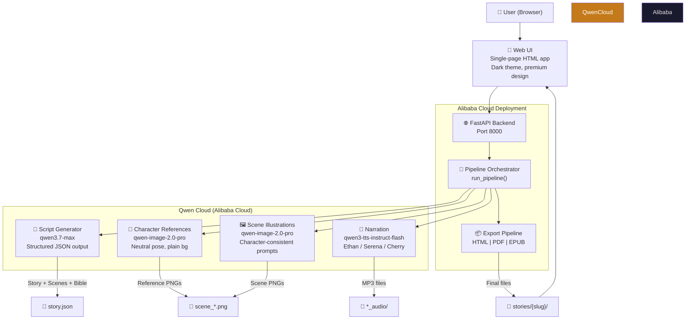

# Imaginate — Architecture

## Data Flow

1. **User submits prompt** → FastAPI backend receives it
2. **Script Generator** calls qwen3.7-max with structured output → produces Story, Scenes, CharacterBible
3. **Character References** calls qwen-image-2.0-pro once per character → neutral reference images
4. **Scene Illustrations** calls qwen-image-2.0-pro per scene with character descriptions from bible
5. **Narration** calls qwen3-tts-instruct-flash per scene → downloads WAV, converts to MP3
6. **Export** assembles all assets into self-contained HTML, printable PDF, and EPUB ebook
7. **User views/downloads** the storybook through the web UI

## Track: AI Showrunner

This project targets the **AI Showrunner** track of the Global AI Hackathon Series with Qwen Cloud.

## Tech Stack

| Layer | Technology |
|-------|-----------|
| Frontend | Vanilla HTML/CSS/JS (single-page app, no build step) |
| Backend | Python 3.12, FastAPI, uvicorn |
| LLM | Qwen3.7-max (chat completions, structured output) |
| Image Gen | Qwen Image 2.0 Pro (multimodal-generation) |
| TTS | Qwen3-tts-instruct-flash (multimodal-generation) |
| PDF | weasyprint |
| EPUB | ebooklib |
| Deployment | Alibaba Cloud Function Compute + API Gateway + OSS |